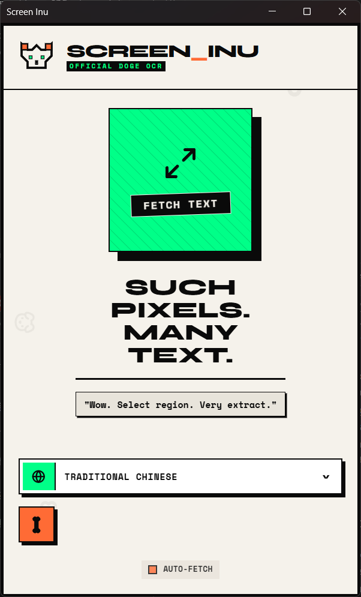
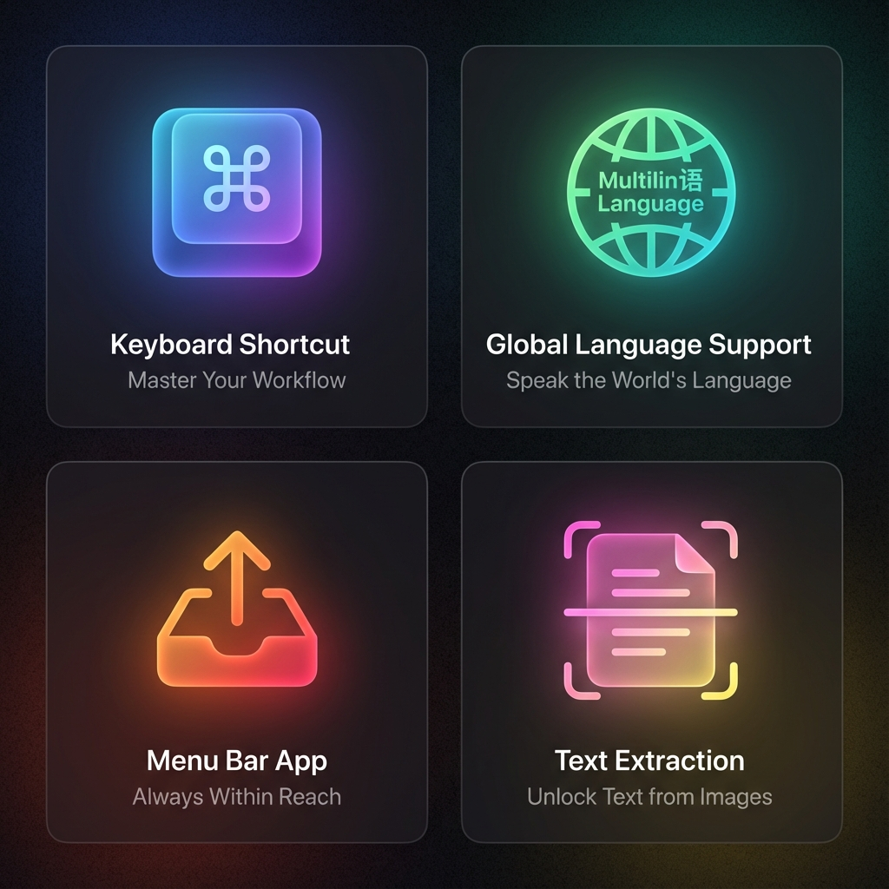
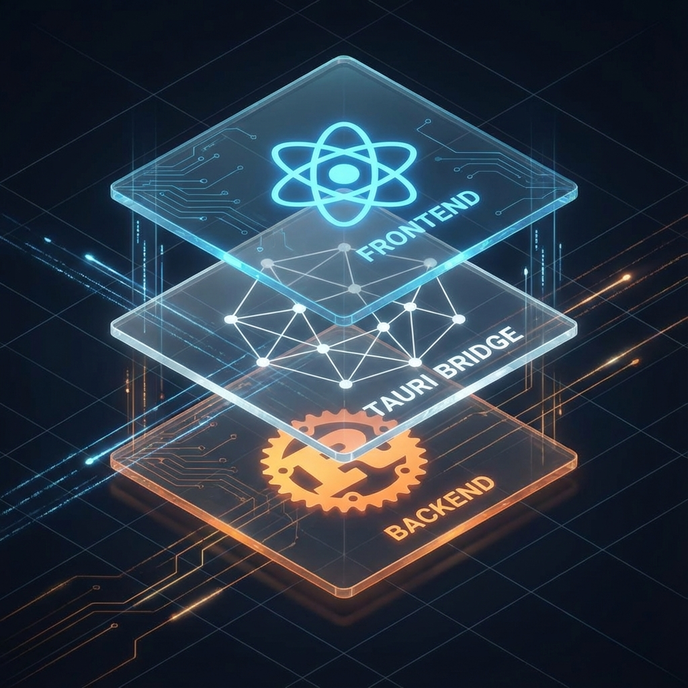

<div align="center">
  
  
  <h1 style="font-size: 3rem; margin-top: 1rem;">Screen Inu 🐕</h1>
  
  <p>
    <strong>Snap. Recognize. Copy.</strong> <br />
    A modern, cross-platform screenshot OCR tool powered by Rust & Tauri.
  </p>

  <p>
    <a href="README.md">English</a> •
    <a href="README_zh-TW.md">繁體中文</a> •
    <a href="README_zh-CN.md">简体中文</a> •
    <a href="README_ja.md">日本語</a> •
    <a href="README_ko.md">한국어</a>
  </p>

  <p>
    <a href="#features">Features</a> •
    <a href="#workflow">Workflow</a> •
    <a href="#architecture">Architecture</a> •
    <a href="#getting-started">Getting Started</a>
  </p>

  
  
  
  
</div>

<br />

## ✨ Features

<div align="center">
  
</div>

*   **Global Shortcut** (`Ctrl/⌘ + Shift + X`): Snap from anywhere, anytime.
*   **Multi-language Support**: Fully localized interface in **English** and **Traditional Chinese (繁體中文)**.
*   **High Accuracy OCR**: Powered by Tesseract engine, specialized for English and Chinese.
*   **History Vault**: Automatically saves your recent snips and OCR results locally.
*   **Auto-Copy**: Optionally text to clipboard automatically after recognition.
*   **Dark/Light Theme**: Beautiful glassmorphism UI that adapts to your preference (Auto-saved).
*   **System Tray Integration**: Stays quietly in your menu bar, ready when you are.
*   **Modern UI**: Brutalist "Inu" themed design with smooth Framer Motion animations.
*   **Cross-Platform**: Built on Tauri, compatible with macOS, Windows, and Linux.

---

## 🚀 Workflow

<div align="center">
  
</div>

1.  **Capture**: Trigger the global shortcut to freeze your screen.
2.  **Select**: Drag to select the area containing text.
3.  **Recognize**: The app automatically extracts text using the integrated OCR engine.
4.  **Copy**: Click to copy the result to your clipboard instantly.

---

## 🏗️ Architecture

<div align="center">
  
</div>

Screen Inu leverages the power of **Tauri 2.0** for a lightweight, secure, and performant desktop experience.
*   **Frontend**: React + TypeScript + TailwindCSS for a responsive and beautiful interface.
*   **Bridge**: Tauri's IPC allows seamless communication between the UI and system-level operations.
*   **Backend**: Rust handles heavy lifting—screen capturing (`xcap`), image processing, and OCR (`rusty-tesseract`).

---

## 🛠️ Getting Started

### Prerequisites
*   **Node.js** (v18+)
*   **Rust** (latest stable)
*   **Tesseract OCR** with language packs

#### Tesseract Installation by Platform

<details>
<summary><strong>macOS</strong></summary>

```bash
brew install tesseract tesseract-lang
```
Grant Screen Recording permission in **System Settings > Privacy & Security > Screen Recording**.
</details>

<details>
<summary><strong>Windows</strong></summary>

1. Download installer from [UB Mannheim](https://github.com/UB-Mannheim/tesseract/wiki).
2. During install, select **Additional language data** (e.g., Chinese Traditional, Japanese).
3. Add Tesseract to your `PATH` (installer usually offers this option).
4. Verify: `tesseract --version`
</details>

<details>
<summary><strong>Linux (Debian/Ubuntu)</strong></summary>

```bash
sudo apt update
sudo apt install tesseract-ocr tesseract-ocr-chi-tra tesseract-ocr-jpn
```
For other distros, consult your package manager.
</details>

---

### Installation

1.  **Clone the repository**
    ```bash
    git clone https://github.com/ImL1s/screen_inu.git
    cd screen_inu
    ```

2.  **Install dependencies**
    ```bash
    cd app
    npm install
    ```

3.  **Run in Development Mode**
    ```bash
    npm run tauri dev
    ```

4.  **Build for Production**
    ```bash
    npm run tauri build
    ```
    *   **macOS**: `.app` and `.dmg` in `src-tauri/target/release/bundle/`
    *   **Windows**: `.msi` or `.exe` (NSIS) in `src-tauri/target/release/bundle/`
    *   **Linux**: `.AppImage` or `.deb` in `src-tauri/target/release/bundle/`

## 📄 License

This project is licensed under the MIT License - see the [LICENSE](LICENSE) file for details.

---

<div align="center">
  <sub>Built with ❤️ by ImL1s</sub>
</div>
